# [Link1]([https://sites.google.com/view/william-hopton-portfolio/home](https://github.com/Yuzu2005/Yuzu2005.github.io/blob/main/Other.md))

You can also view my CV in the link [here](https://onedrive.live.com/:w:/g/personal/a99cabd9fb130e17/IQBh1YdwsWm9QonTJTF_Ba8yATeuV23kOgJGlbUxX9ObdZQ?rtime=V7q_leEX30g&redeem=aHR0cHM6Ly8xZHJ2Lm1zL3cvYy9hOTljYWJkOWZiMTMwZTE3L0lRQmgxWWR3c1dtOVFvblRKVEZfQmE4eUFUZXVWMjNrT2dKR2xiVXhYOU9iZFpR).

# Pages:
## [Level 4: Group Project](#Group-Project-Pointer)
## [Level 4: Pinball Game](#Pinball-Project-Pointer)
## [Level 5: Main Menu Creation](#MainMenu-Project-Pointer)
## [Level 5: Boids](#Boids-Project-Pointer)
## [Level 5: Help With Level 6 Group Project](#Help-With-Level-6-Group-Project-Pointer)
## [Level 6: Final Year Group Project](#Final-Year-Group-Project-Pointer)
## [Level 6: Independent Research Project](#Independent-Research-Project-Pointer)

### Level 4: Group Project

During my first year I worked together in a team of 5 to make a top down shooter game. I was one of two programmers and was in charge of creating the enemies. If you wish to play the game then follow the link via the home page.

For this project I worked on a couple of mechanics mainly to do with the enemy AI.

* I worked partly on the spawner for enemies however I didn't make it randomly move around.

* Pathfinding around the map and searching for the player.

* Created melee enemies which ran at the player and did damage when close up

* Created shooter enemies which shot bullets at the players

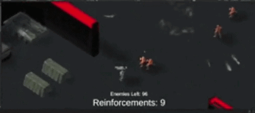

* Created a tank which shot giant bullets that added a force to where they hit. This was also the boss of the game.

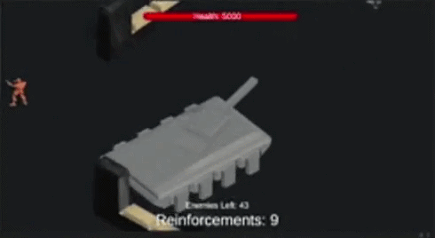

##### Tank code for movement

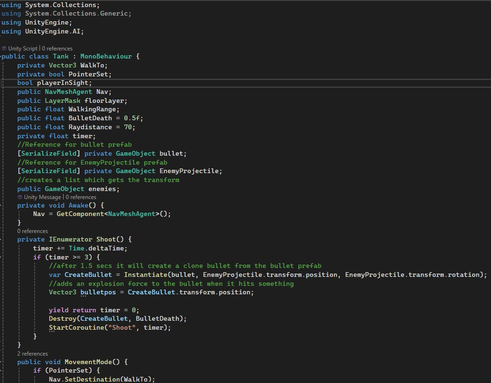

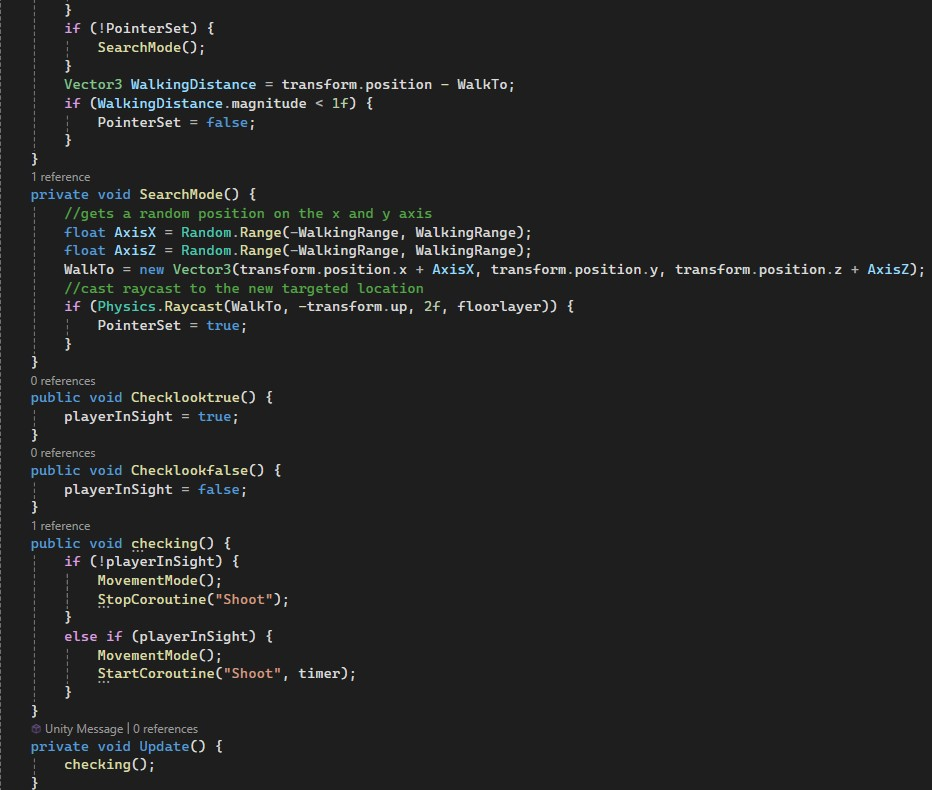

After finishing the project I felt I had learnt a lot about working in a team as well as how to implement enemies and animations into a game. However, during the project I couldn't figure out why the enemies kept getting stuck on corners. Though now I believe that could easily be fixed by sampling the position of the navmesh.

### Level 4: Pinball Game

For this game I was tasked with making a pinball game for mobile phones. In the end I created it so you could use buttons to hit the ball. I also got it to work for mobile by testing it on university supplied phones. Below is a video showcasing what I did.

During this project I added:

* Controls to use the paddles to hit the ball

* Integration onto a mobile phone

##### Code for final barrier at the bottom of the screen.

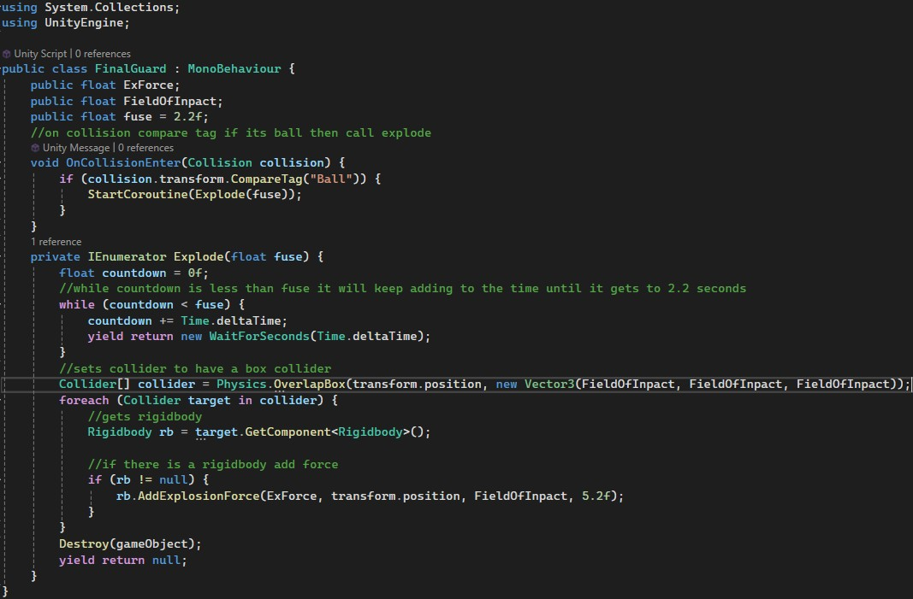

At the end of the project I had learnt a basic understanding on how games could be added onto a mobile platform.

### Level 5: Main Menu Creation

For this project I created a Main Menu system that would have local multiplayer implemented in unreal engine 5. The video below shows what I made.

For this project I made:

* A main menu with buttons such as play, quit and resolution buttons.

* Hosting and joining the same level with friends by connecting to Lan.

* Changing a colour of a spotlight with C++.

Afterwards, I feel like I know more about how to use C++ with unreal as well as how to create a multiplayer system. I also created a small animation for pulling the phone up when needing to look at the menu. To make the game more immersive I did some research and found out how to add widgets in the game instead of just on the viewport. If I were to do this again I would have wished to add more to the C++ as I thought there wasn't enough to it in the game.

### Level 5: Boids

For this project I made flocking behaviours in unreal engine 5. Below shows a demonstration of how it works.

For the main mechanics I made behaviours such as:

* Alignment, so when the Boids were in a certain radius of each other they would all face in a certain direction together.

* Cohesion, for making the Boids stick close to each other.

* Separation, so if the Boids got too close too each other they would fly away.

* Seeking other Boids and tagging them as well as fleeing for the Boids being chased.

* Avoidance for objects so if a Boid got close to a object with the wall script it would avoid it.

* I also added sliders for different values of the Boids so you could see how the behaviours would change. You can see this in the gifs above.

Now after the project is finished I feel I understand much more about how to use C++ with unreal engine as well as understanding the basics to flocking behaviours. Though I do feel if I had more time I have tried to add a bounds volume to stop the Boids wandering too far off.

### Level 5: Help With Level 6 Group Project

For this project I worked with the year above to help create their game.
The main mechanics I created included:

* Enemies such as the Seagulls, slimes and shark behaviours.

* Adding the main menu and button functions with keyboard controls.

The enemies also all had different functions such as patrolling and functions to do with flying. I also used raycast's for ray direction as this was more accurate at finding the player than the previous group project that used box collisions.

After finishing the project I feel I know a lot more to do with the UI side of unity. I also feel like the project taught me more on AI as before in the first group project I did the enemies were very basic. Now after creating enemies for this game I have learnt how to make the enemies behave more efficiently.

### Level 6: Final Year Group Project

For this project I worked in a team to create a horror game rated Pegi 12. I was the lead programmer and was in charge of creating most of the mechanics for the game. This mainly included:

* Monster mechanics, like movement and chasing the player.

##### Monster Logic

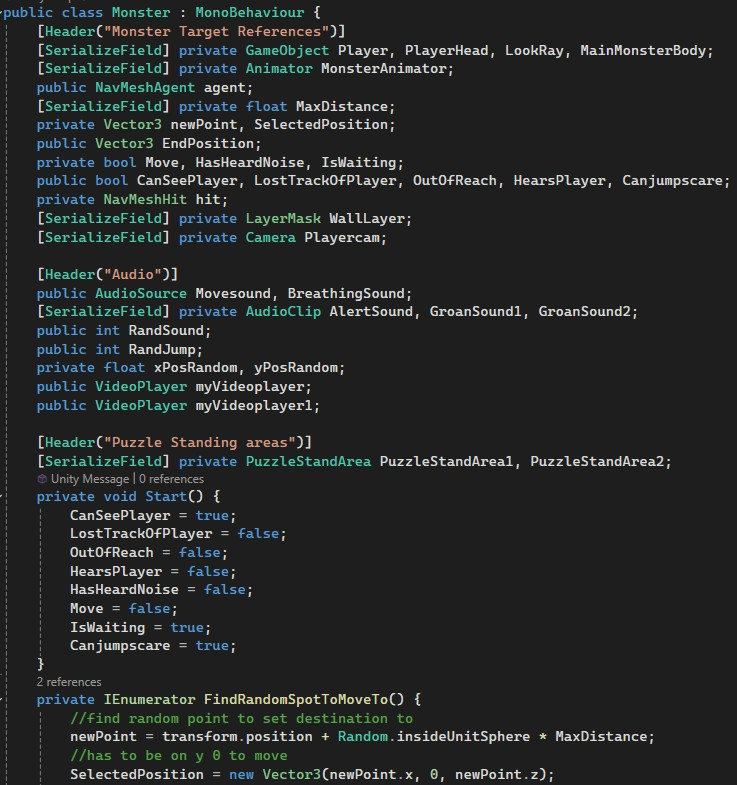
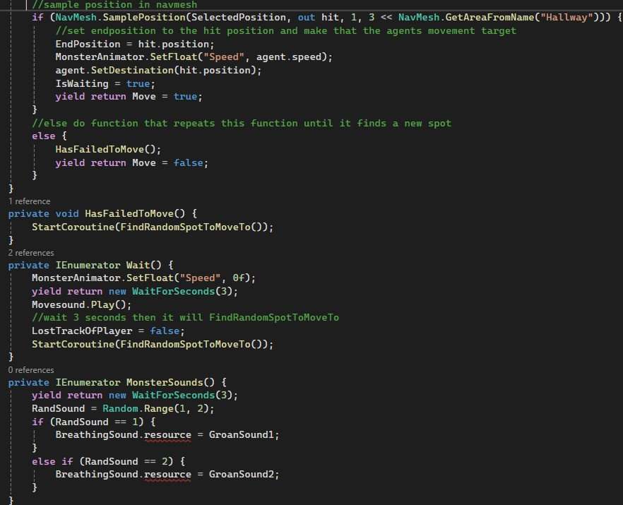
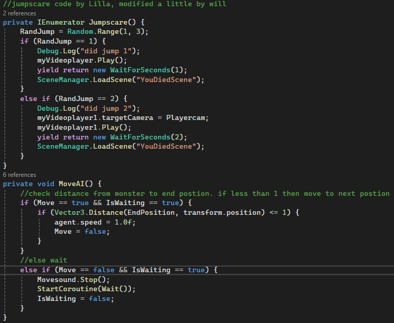
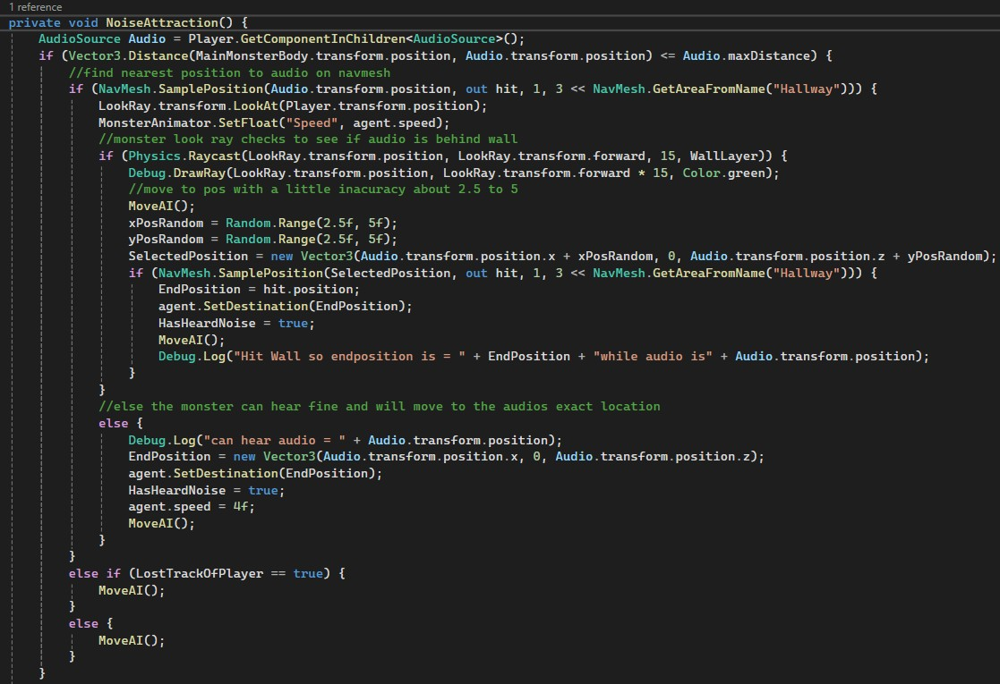
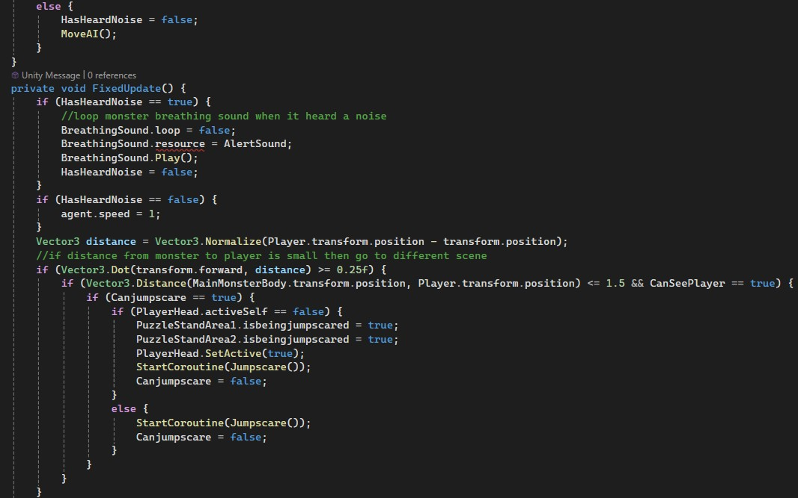
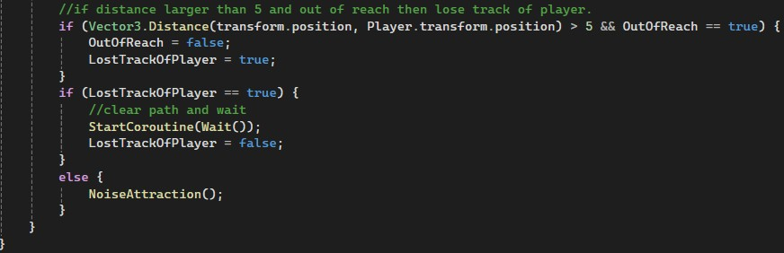

* Player Movement, crouching to hide from monster

* Throwables

* UI Screens

In the end of the project I believe I have improved and learnt how to communicate effectivly as well as work within a team. I also developed my skills in producing an AI agent and experimented with how it would hear sound. Finally, I learnt more about the animator, its references and how to link up an animation with a quick time event.

### Level 6: Independent Research Project

For this assignment I chose to research about customisation in fighting games. I was tasked in creating a research document and then producing a project that fit with my research. The final product included:

* A skill tree, which increased the players stats as well as give two new abilitys that were invisibility and magic

##### Fireball logic

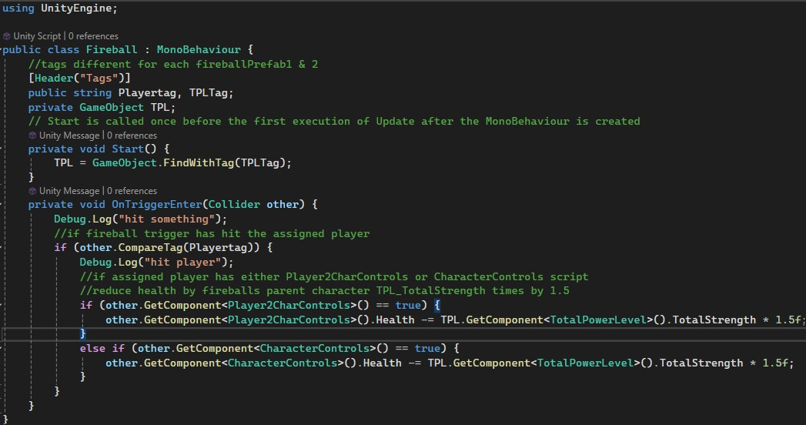

##### PunchCheck logic

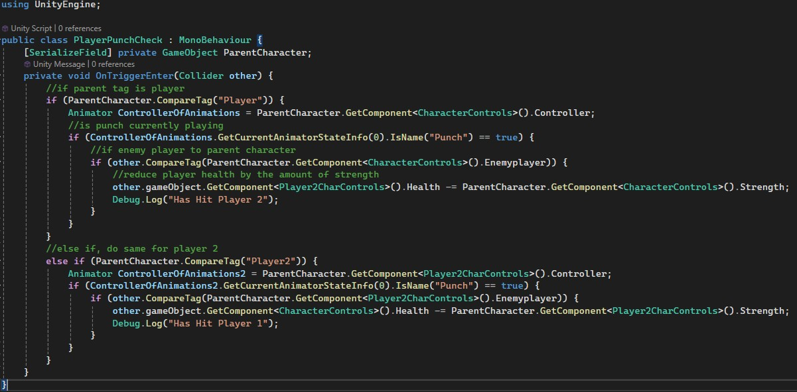

* Customisable parts

* Four different body types with base stats.

* UI elements

* Local Multiplayer

To conclude, I believe that this project has helped me to understand exactly what goes into making satisfying, customisable, elements in fighting games and how to make them engaging to players. It also helped to improve my skills with using Unity's UI elements.
